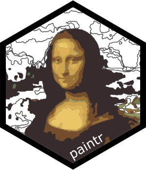

<!-- README.md is generated from README.Rmd. Please edit that file -->

```{r, include = FALSE}
knitr::opts_chunk$set(
  collapse = TRUE,
  comment = "#>",
  fig.path = "man/figures/README-",
  dpi=300)
```

# paintr </a>

<!-- badges: start -->

[](https://www.tidyverse.org/lifecycle/#experimental)

<!-- badges: end -->

The goal of `paintr` is to convert images to paint-by-numbers pictures. It's intended to be a bit of fun! 

All image processing and colour picking is done by the splendid `magick` package. The image polygons are processed using the equally splendid `sf` package with simplification handled by `rmapshaper`. 

```{r}
library(paintr)
```

Noise reduction, smoothing and polygon simplification are applied by default through the `noise_reduction`, `despeckle_passes` and `simplify` arguments. These arguments (along with `ncols`) make the biggest changes to the overall 'feel' of the image and should be experimented with in order to achieve the desired results.

## Use 
Use of the `paint_by_numbers()` function is demonstrated with Hadley Wickham's photo

Path to image
```{r}
img <- 'https://miro.medium.com/max/450/1*1xHqHD8Mbk-m5JviP5-lqw.jpeg'
```

```{r message=FALSE, warning=FALSE}
hadley <- paint_by_numbers(img)
```

```{r fig.width=6, fig.height=6}
hadley$paint_by_numbers
```

```{r fig.width=6, fig.height=6}
hadley$painted_picture
```

## Supply a palette
It's tough to get a good selection of colours to use as a target palette for the output image. If the automatically chosen colours just don't cut it, you can supply your own target colour palette. The colours in the original image will be mapped to the 'closest' colour in the supplied target palette. Here demonstrated with a palette of grey colours. 

Other cool packages for creating colour palettes (such as `colorfindr`) could also be used to supply a target palette.

```{r fig.height=6, fig.width=6, fig.show="hold", out.width="50%", message=FALSE, warning=FALSE}
paint_by_numbers(img, target_palette = grey.colors(3))
```
